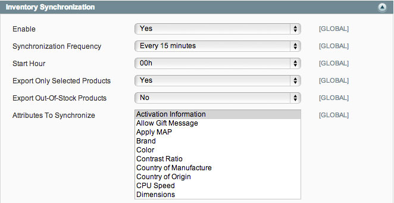

# Official Neteven Marketplace Connector

Module Version: 1.1.0.0

## Compatibility

The Neteven connector is compatible with the following Magento versions:

- Magento Community Edition 1.6+ > 1.8
- Magento Enterprise Edition 1.11+ > 1.13

## Setup

### With Magento Connect

The module is available on Magento Connect. The setup process is standard and like any other community module.

1 . Login to your Magento Connect Manager page with your backend credentials:

	http://domain.com/downloader/
	

	
2 . Insert the Neteven module extension key in the matching field:

	http://connect20.magentocommerce.com/community/neteven_netevensync


	
3 . Validate by clicking the **Install** then **Proceed** button

4 . The module will now be available in your installed modules list


5 . The setup is now complete. You can now return to your backend with the link **Return to Admin**

### Checking your setup

Once the module installed, check that the matching configuration item **Neteven Synchronization** is available in the **Services** part of the **System > Configuration** panel. You may have to logout and login again in case a 404 error appears when browsing to the Neteven Synchronization configuration panel.


## Configuration

### Requirements

#### Scheduled tasks (cron)

In order to use the automatic import/export processes shipped with the module, your system must already be configured to use the Magento scheduled tasks (cron). You can check the [official documentation](http://www.magentocommerce.com/wiki/1_-_installation_and_configuration/how_to_setup_a_cron_job#magento_and_crontab) for further information on how to proceed to cron tasks setup.

#### Activating and whitelisting Neteven WebService

Please check with your Neteven Account Manager that your WebService level access is enabled.

If your Magento server is blocking outgoing connections to external machines, you should now authorize http connections to the ```http://ws.neteven.com``` host.

#### Tax rates by country setup

In order to enable the orders synchronization, you have to check if your Magento instance is configured to handle tax calculations for orders shipped in all available countries selected in Neteven marketplaces.

You will have to setup the tax rate to suit the marketplaces enabled in your Neteven account.

Check the [official documentation](http://www.magentocommerce.com/knowledge-base/categories/category/tax-settings/) for more information on tax rates configuration.

### General setup

The module configuration is available under the **Neteven Synchronization** item in the **Services** panel of the **System > Configuration** page.

All settings listed below have a Magento global scope impacting all websites, stores and storeviews configured on your Magento instance. This module only works between one Magento instance and one Neteven user account.

The configuration page follows Magento backend principles. You will have to save settings before launching any manual import/export or make a connection parameters test (see below). 

The only required fields of the configuration are account credentials. In order to configure them, fill in the credentials you usually use to connect the Neteven backend in the **Email** and **Password** fields.


Once completed, save the configuration and click on **Test connection setup**.

Magento should now display a success alert showing that your credentials are correct.


If an error occurs, the following message will be displayed:


Check that the credentials typed match your Neteven account or contact your Neteven Account Manager (contact information in the **HelpDesk** section below).

Please also make sure to save the configuration after changing your credentials information and prior to making any connection test with new credentials information.

#### Debugging and sandbox mode

When turning on the debugging mode, all contents from requests sent to and all responses received from the Neteven ```http://ws.neteven.com``` host are logged in a file named "neteven_debugging.log" saved in the /var/log folder of your Magento instance.

When using the Sandbox mode, no real order are synchronized between Magento and the Neteven platform. Only orders that are present in the "Sandbox" marketplace in the Neteven platform are synchronized. **Please contact you Neteven Account Manager (contact information in the HelpDesk section below) to make sure that the "Sandbox" marketplace has been properly setup**.

### Inventory synchronization

The first configuration step of the module is about exporting your products catalog.



The fields are:

- Enabled: Yes/No. Allows you to choose if you want to enable synchronization of catalog products.
- Synchronization frequency: Change the automatic incremental exports frequency. This setting needs to be set accordingly to your update needs.
- Start hour: Time of the first export iteration and calculation base for every export then. Example: If you have a "4 hours" frequency and a "Start hour" at 3am, exports will occure at 3am, 7am, 11am, 3pm, 7pm and 11pm.
- Export only selected products: the module will, by default, export all products available in the Magento catalog. In order to restrict the export to only needed products, select Yes in this field and manage your products selection in the dedicated panel (see below). Only these products will be sent to Neteven.
- Export Out-Of-Stock products: Allows you to choose if you want to send only in-stock products or all products of the Magento catalog.
- Included Attributes: This multiple selection field lists all product attributes created in your Magento instance that are relevant for export. Select the ones that need to be included in the export file. **In order to be correctly processed, these attributes must also be configured on the Neteven backend based on the product type**.

In order to provide more accurate data to the marketplace and link your products easily, Neteven allows you to provide additional fields like the ISBN number for books. 

As these attributes are not created by default in a fresh Magento setup, you will need to create them by using the attributes sets system in order to use them. Once created, you will have to map them in the configuration panel.

To map them, please select the right attribute for the specific fields you need:


You will be able to select, for each specific Neteven attribute, its matching Magento attribute. Only those useful for your products catalog should be configured.

#### Attributes that are synchronized by default

Some product attributes are required by Neteven so they are exported automatically by the module.

Those attributes (attributes codes) are:

- ```name```
- ```short_description```
- ```description```
- ```model```
- ```cost```
- ```weight```
- ```price```
- ```weee```
- ```image```
- ```media_gallery```
- and tax rate which is calculated based on the ```tax_class_id``` attribute

#### Multi-views management / multi-languages

Magento store views are mapped with Neteven languages. Each Magento store view can be mapped to a Neteven language. If filled up, product data from each store view is exported to the corresponding language in Neteven.

In order to configure a *Magento store view <--> Neteven language* mapping, change configuration scope and choose a store view.

Configuration area below must be visible :


Choose a Neteven language to which the current store view must be mapped. Repeat for other store views to export.

- **Please note**: price data is always [GLOBAL]. Attributes with a "price" type are always sent with their default value.
- **Please note**: categories are always [GLOBAL]. Default category tree is always sent to Neteven.
- **Please note**: as soon as a *Magento store view <--> Neteven language* mapping is done, data from store views having a mapping is solely exported. **Default data is exported when no mapping exists**

Localized information in Neteven Console, example:


>Please get in touch with your Account Manager Neteven in case of specific needs.


### Stocks synchronization

Once the inventory synchronization has been configured, the next step is to setup the stock synchronization. Just edit the following fields:


- Enabled: Yes/No. Allows you to choose if you want to use synchronize stock data.
- Synchronization frequency: Change the automatic incremental exports frequency. This setting need to be set accordingly to your update needs.
- Start hour: Time of the first export iteration and calculation base for every export then. Example: If you have a "4 hours" frequency and a "Start hour" at 3am, exports will occure at 3am, 7am, 11am, 3pm, 7pm and 11pm.
- Export only selected products: the module will, by default, export all products available in the Magento catalog. In order to restrict the export to only needed products, select Yes in this field and manage your products selection in the dedicated panel. Only the stock values for products present in selected products will be sent to Neteven. This setting should be configured according to the inventory synchronization setup.
- Export Out-Of-Stock products: Allows you to choose if you want to send only in-stock product stock values or all products stock values of the Magento catalog.
- Synchronize Prices Attributes : Price data (from attributes synchronized by default + configured attributes of a "price" type) is added to stock information.

The data volume being lower than the inventory synchronization, you can select a higher synchronization frequency.

### Orders synchronization

The configuration final step is to configure the orders synchronization. The Neteven module works both ways:

- Magento gets all new marketplaces orders from Neteven
- Magento sends back the updated order statuses to Neteven which then updates all marketplaces.

The setup is based on the following fields:


- Enabled: Yes/No. Allow you to choose if you want to enable orders import and export.
- Synchronization frequency: Change the automatic incremental exports frequency. This setting needs to be set accordingly to your update needs.
- Start hour: Time of the first export iteration and calculation base for every export then. 	Example: If you have a "4 hours" frequency and a "Start hour" at 3am, exports will occure at 3am, 7am, 11am, 3pm, 7pm and 11pm.
- Minimal order status: Define the minimum status needed for the orders to be synchronized from Neteven and its marketplaces. Any order with a status below this threshold will be ignored.

Magento order statuses being configurable, you will need to map your local Magento order statuses with the default Neteven ones. Without this step, the orders workflow can't be properly executed.

In order to do that mapping, slide down the *Neteven -> Magento Orders Mapping* block. For each Neteven status, select the matching Magento status. While configuring a default Magento instance, you should obtain these settings:


Once this step is completed, you will have to do the same for the reverse way. Slide down to the *Magento -> Neteven Orders Mapping* block. A full list of all available Magento order statuses will be displayed. Select the matching Neteven status for each line of the order workflow:


Save all settings by clicking on the **Save** button in the top right hand corner.

#### <a id="orders_multistore"></a>Multi-store / multi-languages management

Magento store views are mapped with Neteven countries. Each Magento store view can be mapped to a Neteven country. Orders imported from Neteven to Magento are thus attached to their respective store views depending on their country.

To configure a *Magento store view <--> Neteven country* mapping, please change current configuration scope and choose a store view.

Configuration area below must be visible : 


Choose which country to map to the current store view. Repeat for other store views.

- **Please note**: if the country of an order imported from Neteven is not mapped to any store view, the order will be attached to the default store view.

Sample orders imported from Neteven and attached to different store views:


>Please get in touch with your Account Manager Neteven in case of specific needs.

### Shipping method selection

Even if the Neteven module includes the update of shipping costs from Neteven data, you will need to select the shipping method used for the marketplaces related shipments. Select in the list of all available shipping methods the one you want to be used for all Neteven orders:


**Please note - multi-views configuration :** Changing configuration scope gives the ability to choose a different carrier for each store view. It is then required to configure *Magento store view <--> Neteven country* mappings (see [Multi-store / multi-languages management](#orders_multistore)).

## Usage

### Manual import/export

Once the configuration has been done and saved, all files exchanges will be automatically managed by the scheduling system at defined hours.

If however want to force a synchronisation, you can, for every data type, click on the **Synchronize now** button.

For the inventory synchronization, you can force an incremental or a full synchronization. Please be aware that the volume needed to export all products can impact your site performance. The panel on the left displays the number of products being queued (added, edited or deleted) for the next synchronization: 


The orders synchronization block lets you search and synchronize all orders from a specified datetime. In the following example, all orders updated on Neteven and Magento after January 1st, 2013 will be imported and exported.


In case of a status mismatch for an order (eg. an order has a Neteven status below the Magento one), it will be ignored.

In order to bypass the PHP and Magento execution time and memory limits, the synchronization system uses the Magento Ajax dataflow system. When manually launching a synchronization, a new window will be opened:


**This window must stay opened until the process is completed for the synchronization to properly work**. Once finished, you can close the process window.

### Neteven Console

*Even MarketPlaces*, Neteven's inventory and orders management is available in the Magento admin. It is available by going to: **Catalog > Neteven > Neteven Console**.

You must then provide your Neteven credentials:


Once logged in, you can access all Neteven features right thru the Magento admin:


### Products selection

The module default behavior is to export the complete products catalog to the Neteven system. If you want to only synchronize some of them, you will have to enable and configure the **Neteven selection**.

1. Check that the inventory synchronization field **Export only selected products** is set to **Yes**
2. Also check the same setting for the stock synchronization.

You can now go to the menu item **Catalog > Neteven > Neteven Selection**.

This configuration screen is divided in two parts:

- Exported products: list all products currently being selected for the export process.
- Available products: display all products that are not yet being selected.

To add some products to the selection, just click on **Available products** and select the ones to be exported by checking their row.


You can filter the results list and cycle through them by using the pagination system like in any other Magento data grid.

Once the products you want to add are checked, validate by clicking on **Add selected products to the selection**. Once the page has been reloaded, you will be on the exported products list.


Once again, you can use the filter and pagination systems to navigate through this list.

To remove a product from the selection, simply tick its corresponding checkbox in the exported products listing and click on the **Remove selected products from the selection** button. The page will be reloaded with an updated list.

Also, by clicking the **Reset** button, the whole "Neteven Selection" page will be reloaded and **any checked item in "Exported Products" and "Available Products" will be unchecked**.

### Errors logging

When an unexpected behaviour comes up while synchronizing, the Magento administrator is automatically alerted by the display of a Magento error notice specifying which synchronizations experienced errors:


More details on the error will be available in the neteven module log:

	user@server:~# tail -f {Magento path}/var/log/neteven.log
	
You will be able to detect which entity is causing the error and an error message on the reason why it failed:

	2013-03-28T10:49:52+00:00 DEBUG (7): Imported order item does not exist in catalog. Item ID: 6734200, Order ID: 3788519, Sku: TEST_1

When an entity id is blocking the synchronization, it will be automatically ignored unless the administrator modifies it.

## HelpDesk

Neteven - www.neteven.com

Phone: +33 (0) 1 83 64 59 50

http://www.neteven.co.uk/neteven-contact-us.html

## Credits

Development: Agence SOON

http://www.agence-soon.fr