# Connecteur officiel Neteven / Magento

Version du module : 1.1.0.0

## Compatibilité

Le module de synchronisation Neteven est compatible avec les versions suivantes de Magento :

- Magento Community Edition 1.6+ > 1.8
- Magento Enterprise Edition 1.11+ > 1.13

## Installation

### Via Magento Connect

L'extension étant disponible sur Magento Connect, la procédure d'installation est similaire à tout autre module communautaire.

1 . Connectez vous à votre système de mise à jour avec vos identifiants :

	http://votresite.com/downloader/
	
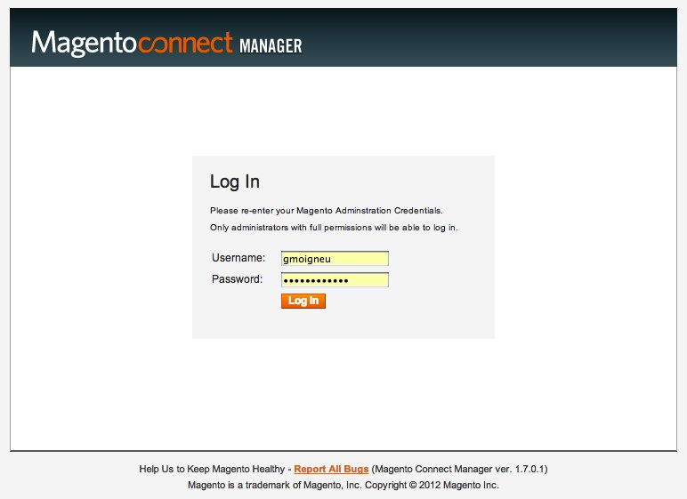
	
2 . Puis saisissez la clé d'installation du module dans le bloc dédié :

	http://connect20.magentocommerce.com/community/neteven_netevensync


	
3 . Validez via les boutons **Install** puis **Proceed**.

4 . Le module sera alors présent dans la liste des modules installés 

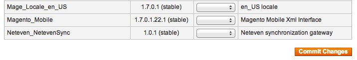

5 . L'installation est terminée. Retournez à l'administration du site via le lien **Return to Admin**

### Vérification de l'installation

Une fois le module installé, vérifiez que l'item de configuration **Synchronisation Neteven** est bien présent dans l'onglet **Services** de la page **System > Configuration**.


## Configuration

### Prérequis

#### Tâches automatisées (cron)

Afin de bénéficier des imports/exports automatiques proposés par le module, vous devez avoir au préalable configuré le système de tâches automatisés Magento (cron). Vous pouvez retrouver la documentation du système cron [ici](http://www.magentocommerce.com/wiki/1_-_installation_and_configuration/how_to_setup_a_cron_job#magento_and_crontab).

#### Activation et autorisation du WebService Neteven

Vérifiez auprès de votre Account Manager Neteven que l'accès aux WebServices est bien activé pour votre compte.

Dans le cas où votre serveur hébergeant Magento serait bridé en terme de sortie vers des machines externes, il est impératif d'autoriser ce serveur à accéder à l'adresse ```http://ws.neteven.com```.

#### Configuration des taxes par pays

Pour activer la synchronisation des commandes, vous devez au préalable vous assurer que votre instance Magento est correctement configurée pour calculer les taxes des commandes à destination des différents pays de livraison possibles.

Il sera ainsi nécessaire de configurer ces règles pour satisfaire les besoins des différentes places de marché activées sur votre compte Neteven.

Vous pouvez vous référer à la documentation officielle de la configuration des taxes [ici](http://www.magentocommerce.com/knowledge-base/categories/category/tax-settings/).

### Configuration générale

La configuration du module est accessible via l'item **Synchronisation Neteven** présent dans l'onglet **Services** de la page **System > Configuration**.

Les éléments de configuration listés ci-dessous ont une portée globale sur l'instance Magento. Le module de synchronisation permet l'échange d'information entre une plate-forme Magento et un seul compte utilisateur Neteven.

La page de configuration suivant les principes du backoffice Magento, **il vous sera nécessaire de sauvegarder les paramètres avant d'effectuer les tests ou les lancements d'imports/exports manuellement**. Le cas échéant les anciens paramètres seront utilisés.

Les seuls renseignements obligatoires de la configuration concernent l'accès à votre compte Neteven. Pour les saisir, compléter les champs **Email** et **Mot de passe** que vous utilisez pour vous connecter à la plate-forme web Neteven :


Une fois ces champs saisis, sauvegardez la configuration puis cliquez sur **Testez les paramètres de connexion**.

Magento devrait alors vous afficher un message d'alerte confirmant la validité de vos identifiants :


En cas d'erreur dans vos identifiants, le message suivant sera affiché :

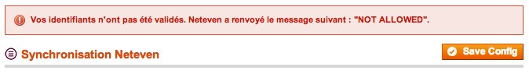

Vérifiez les éléments saisis ou reportez vous à la rubrique **Assistance** de cette documentation afin de contacter votre interlocuteur Neteven.

#### Modes Debug et Sandbox

Lorsque le mode Debug est activé, toutes les requêtes envoyées et les réponses reçues de la part de ```http://ws.neteven.com``` sont enregistrées dans un fichier nommé "neteven_debugging.log" et présent dans le dossier /var/log de votre instance Magento.

Lors de l'utilisation du mode Sandbox, aucune commande réelle n'est synchronisée entre Magento et Neteven. Seules les commandes présentes dans la place de marché "Sandbox" chez Neteven sont synchronisées. **Merci de vous rapprocher de votre Account Manager Neteven afin de vous assurer que la place de marché "Sandbox" a bien été configurée**.

### Synchronisation de l'inventaire

La première étape de configuration du module concerne la configuration de l'export de votre catalogue produit.

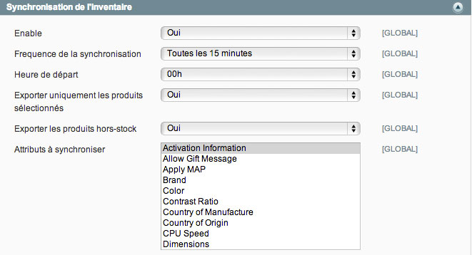

Les champs sont les suivants :

- Activer : Oui/Non. Permet d'activer la synchronisation de l'inventaire
- Fréquence de synchronisation : Détermine la fréquence des exports incrémentaux du catalogue. A configurer en fonction des besoins de mise à jour.
- Heure de départ : Heure à partir de laquelle seront calculées les itérations. *Exemple : Si vous sélectionnez une fréquence de 4 et une heure de départ à 3h, les exports auront lieu à : 3h, 7h, 11h, 15h, 19h et 22h.*
- Exporter uniquement les produits sélectionnés : Par défaut le module exporte l'ensemble du catalogue disponible au sein de Magento. Dans le cas où l'utilisateur sélectionnerait "Oui" dans ce champ, seuls les produits explicitement définis comme à exporter dans la liste de sélection seront synchronisés.
- Exporter les produits hors-stock : Permet de choisir si vous souhaitez envoyer à Neteven les produits hors-stock. Ce champ permet d'exclure les produits non-vendables car hors stock des exports.
- Attributs à synchroniser : Cette liste de sélection multiple vous permet de sélectionner les attributs Magento que vous avez mis en place pour les exporter vers Neteven. **Afin d'être correctement traités à réception par la plate-forme Neteven, ces attributs devront y être au préalable configurés par rapport aux types de produits attendus.**

Afin de fournir des informations plus pertinentes aux places de marché, Neteven propose de renseigner différents attributs tels que l'ISBN pour les livres. Ces attributs n'étant pas gérés nativement dans Magento, vous devrez les créer via le système de sets/attributs. Il sera alors indispensable de lier les attributs Magento venant d'être mis en place avec les attributs attendus par Neteven.

Pour cela, il suffit de choisir les attributs Magento correspondant aux attributs Neteven que vous souhaiter exporter :

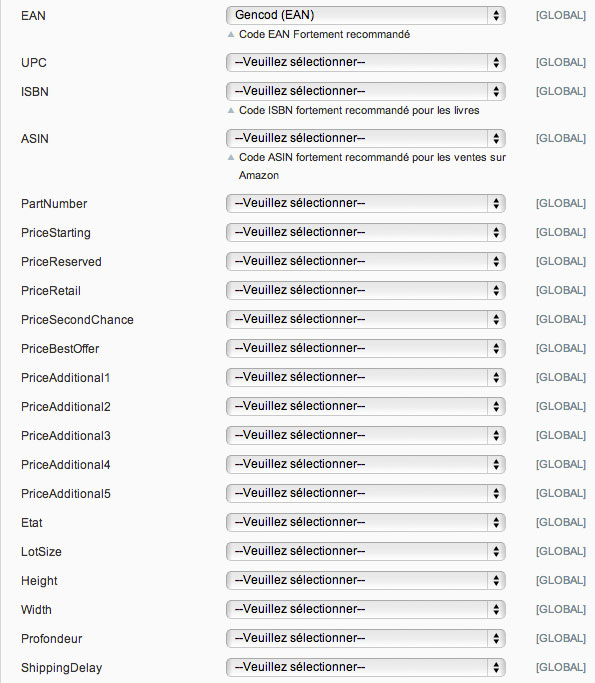

Il n'est pas obligatoire de renseigner l'intégralité des mappings. Seuls ceux utiles à votre catalogue produits sont à configurer.

#### Attributs synchronisés par défaut

Certains attributs devant obligatoirement être envoyés à Neteven, ceux-ci sont exportés par défaut par le module.

Ces attributs (codes attributs) sont :

- ```name```
- ```short_description```
- ```description```
- ```model```
- ```cost```
- ```weight```
- ```price```
- ```weee```
- ```image```
- ```media_gallery```
- ainsi que le taux de taxe calculé à partir de l'attribut ```tax_class_id```

#### Gestion du multi-vues / multi-langues

Les vues Magento communiquent avec les langues Neteven. Chaque vue magasin (Store View) Magento peut être associée à une langue Neteven. Si renseignées, les données des produits de chaque vue magasin seront exportées vers la langue correspondante sur Neteven.

Pour configurer une association *vue magasin Magento <--> Langue Neteven*, changer de portée de configuration et choisir une vue magasin.

La zone de configuration ci-dessous doit être présente :


Choisir la langue Neteven à laquelle associer la vue magasin en cours de configuration. Répéter pour les autres vues magasin à exporter.

- **A noter** : les données prix ne sont gérées qu'au niveau [GLOBAL]. Les attributs de type "price" sont toujours renvoyés avec leur valeur par défaut.
- **A noter** : les catégories ne sont gérées qu'au niveau [GLOBAL]. L'arborescence par défaut reste celle envoyée à Neteven.
- **A noter** : dès qu'une association *vue magasin Magento <--> Langue Neteven* a été réalisée, seules les données des vues magasins pour lesquelles cette association a été réalisée sont envoyées à Neteven. **Les données par défaut sont envoyées quand aucune association n'est configurée.**

Les informations selon la langue dans la Console Neteven, exemple :


>Merci de vous rapprocher de votre Account Manager Neteven en cas de besoin plus spécifique.

### Synchronisation des stocks

Une fois la synchronisation d'inventaire configurée, il vous sera nécessaire d'indiquer les préférences de la synchronisation des stocks. Pour cela, il suffit de renseigner les champs suivants :

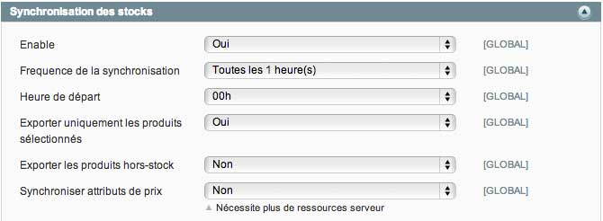

- Activer : Oui/Non. Permet d'activer la synchronisation des stocks
- Fréquence de synchronisation : Détermine la fréquence des exports incrémentaux des stocks. A configurer en fonction des besoins de mise à jour.
- Heure de départ : Heure à partir de laquelle seront calculées les itérations. *Exemple : Si vous sélectionnez une fréquence de 4 et une heure de départ à 3h, les exports auront lieu à : 3h, 7h, 11h, 15h, 19h et 22h.*
- Exporter uniquement les produits sélectionnés : Par défaut le module exporte l'ensemble du catalogue disponible au sein de Magento. Dans le cas où l'utilisateur sélectionnerait "Oui" dans ce champ, seuls les stocks des produits explicitement définis comme à exporter dans la liste de sélection seront synchronisés. Ce choix va de paire avec le réglage correspondant de l'inventaire.
- Exporter les produits hors-stock : Permet de choisir si vous souhaitez envoyer à Neteven les stocks des produits hors-stock.
- Synchroniser les attributs de prix : Les données prix (attributs synchronisés par défaut + attributs de type "price" configurés) sont ajoutées aux informations de stock.

Le volume des données échangées étant plus faible que pour la synchronisation de l'inventaire vous pouvez opter pour une fréquence de synchronisation plus élevée.

### Synchronisation des commandes

La dernière étape de la configuration concerne les commandes. Le module fonctionne de manière bi-directionnelle :

- Magento récupère les nouvelles commandes passées sur les places de marché depuis Neteven,
- Magento renvoie les statuts de commande mises à jour à Neteven pour les retransmettre aux places de marché.

La configuration est composée des éléments suivants :


- Activer : Oui/Non. Permet d'activer la synchronisation des commandes
- Fréquence de synchronisation : Détermine la fréquence des exports des commandes. A configurer en fonction des besoins de mise à jour.
- Heure de départ : Heure à partir de laquelle seront calculées les itérations. *Exemple : Si vous sélectionnez une fréquence de 4 et une heure de départ à 3h, les exports auront lieu à : 3h, 7h, 11h, 15h, 19h et 22h.*
- Etat minimum des commandes : Définit le statut minimum des commandes qui seront synchronisées depuis Neteven et ses places de marché. Toute commande ne satisfaisant pas ce critère sera ignorée.

Les statuts de commande Magento étant configurables et personnalisables, il vous sera nécessaire de lier les statuts de votre installation Magento aux statuts Neteven. Sans cela, le workflow des commandes pourrait ne pas être respecté.

Pour ce faire, cliquez tout d'abord sur l'élément *Neteven -> Magento Orders Mapping*. Pour chacun des statuts possibles chez Neteven, sélectionnez le statut correspondant sur votre installation Magento locale. Dans le cas d'une installation Magento par défaut, vous devriez obtenir le résultat suivant :

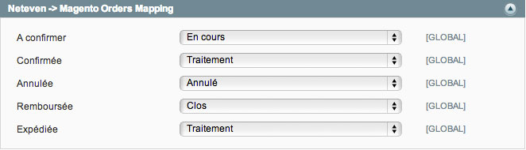

Une fois cette étape effectuée, il faudra vous faire de même dans le sens inverse. Cliquez sur *Magento -> Neteven Orders Mapping*. Vous verrez alors apparaître la liste complète des statuts existant sur Magento. Liez alors chacun de ces statuts à l'étape du workflow correspondant chez Neteven :


Sauvegardez cette configuration via le bouton **Sauvegarder** situé en haut de page.

#### <a id="orders_multistore"></a>Gestion du multi-vues / multi-langues

Les vues Magento communiquent avec les pays Neteven. Chaque vue magasin (Store View) Magento peut être associée à un pays Neteven. Les commandes importées de Neteven vers Magento sont donc affectées à leurs vues magasin respectives en fonction de leur pays  

Pour configurer une association *vue magasin Magento <--> Pays Neteven*, changer de portée de configuration et choisir une vue magasin.

La zone de configuration ci-dessous doit être présente :


Choisir le pays auquel associer la vue magasin en cours de configuration. Répéter pour les autres vues magasin.

- **A noter** : si une commande venue de Neteven est passée depuis un pays non associé à vue magasin Magento, celle-ci sera affectée à la vue magasin par défaut de Magento.

Commandes importées de Neteven et associées à des vues magasin différentes - exemple :


>Merci de vous rapprocher de votre Account Manager Neteven en cas de besoin plus spécifique.


### Choix du transporteur

Même si le module Magento intégre les frais de port remontés par les places de marché dans vos commandes Magento, il est nécessaire de définir le transporteur en charge de ces livraisons. Sélectionnez dans la liste de sélection le mode de livraison qui sera utilisé pour les commandes provenant de Neteven :

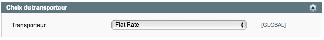

**A noter - Configuration multi-vues :** Changer la portée de configuration permet de choisir un autre transporteur pour une ou plusieurs vues magasin. Il est alors nécessaire d'associer ces vues magasin à un pays Neteven (voir [Gestion du multi-vues / multi-langues](#orders_multistore)).

## Utilisation

### Import/Export manuels

Une fois la configuration effectuée, les échanges se feront de manière automatique aux fréquences définies. Si toutefois vous souhaitez forcer une synchronisation manuelle, il vous est possible, pour chaque type de données échangées, de cliquer sur le bouton **Synchroniser maintenant**.

Dans le cas de la synchronisation de l'inventaire, il vous est possible de lancer la synchronisation incrémentale manuellement ou une synchronisation complète (attention au volume de données et aux ressources de calcul nécessaires). Un bloc vous informe du nombre de produits en attente de synchronisation (ajoutés, modifiés ou supprimés) :


Dans le cas de la synchronisation des commandes, il vous est également possible de forcer la date de recherche. Dans l'exemple ci-dessous, toutes les commandes depuis le 1er janvier 2013 seront récupérées. 


Dans le cas où une commande Neteven aurait un statut inférieur en terme de workflow au statut actuel dans Magento, celui-ci sera alors automatiquement ignoré.

Afin de contourner les limites de ressources fixées dans PHP et Magento, le système de synchronisation manuel utilise la version Ajax des imports/exports Magento. Une nouvelle fenêtre sera donc ouverte :

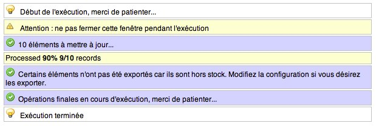

**Cette fenêtre doit rester ouverte afin de permettre à la synchronisation de s'effectuer totalement**. Une fois l'exécution terminée, vous pourrez alors fermer cette fenêtre.

### Console Neteven

Even MarketPlaces, le système de gestion de vos produits et places de marché est accessible via le backoffice Magento. Vous pouvez y accéder via le menu : **Catalog > Neteven > Console Neteven**.

Vos identifiants de compte Neteven vous seront alors demandés :


Une fois connecté, vous aurez alors accès à l'ensemble des fonctionnalités de la plate-forme Neteven directement dans l'interface Magento :


### Sélection de produits

Le fonctionnement par défaut du module est d'exporter l'ensemble des données du catalogue produits vers la plate-forme Neteven. Si vous souhaitez uniquement synchroniser une liste précise de produits, il vous faudra utiliser la **Sélection Neteven**.

1. Assurez vous que l'item de configuration de l'inventaire **Exporter uniquement les produits sélectionnés** est à **Oui**.
2. Faites de même pour l'item de configuration des stocks

Puis accédez au menu **Catalog > Neteven > Sélection Neteven**.

Cet écran est divisé en deux onglets :

- Produits exportés : correspond à la liste des produits inclus dans le processus de synchronisation
- Produits disponibles : affiche les produits n'étant pas inclus dans le processus de synchronisation

Pour ajouter des produits, cliquez sur **Produits disponibles** et cochez dans la liste les produits à ajouter à la sélection. 

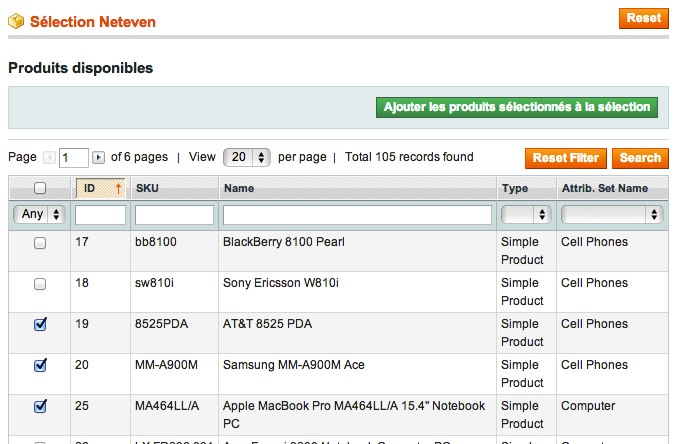

Il vous est bien sur possible de filtrer la liste et de modifier la pagination comme sur l'ensemble des listings de Magento.

Une fois votre choix effectué, validez l'ajout en cliquant sur **Ajouter les produits sélectionnés à la sélection**. Après enregistrement, vous serez alors redirigé vers la liste des produits exportés :

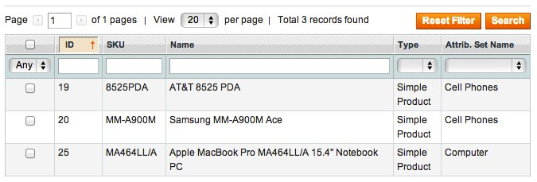

Il vous est bien sûr possible de filtrer cette liste ou de la parcourir afin de retrouver une ou plusieurs références que vous recherchez.

Pour supprimer un produit de la sélection, cochez-le dans la liste des produits exportés et cliquez sur **Supprimer les produits sélectionnés de la sélection**. La page sera automatiquement rechargée avec la liste mise à jour.

Dans le cas où vous souhaiteriez décocher l'ensemble des éléments, utilisez le bouton **Reset** situé en haut à droite du panel. Ce bouton n'a aucun impact sur les données enregistrées dans les listes.

### Remontées d'erreurs

En cas de problème lors d'une synchronisation, une notification Magento sera affichée dans le dashboard précisant le type d'échange impacté :

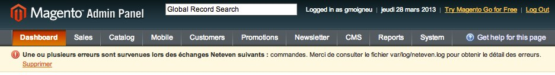

Il vous est alors possible de consulter le log Magento spécifique à Neteven pour obtenir plus d'informations sur l'erreur :

	user@server:~# tail -f {chemin Magento}/var/log/neteven.log
	
Vous obtiendrez ainsi les éléments provoquant l'erreur :

	2013-03-28T10:49:52+00:00 DEBUG (7): Le produit importe n'existe pas dans le catalogue Magento. Item ID: 6734200, Order ID: 3788519, Sku: TEST_1

Dans le cas d'une synchronisation manuelle, la fenêtre affichera directement l'erreur :

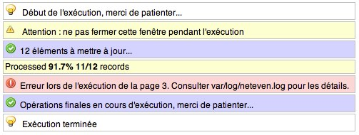

## Assistance

Neteven - www.neteven.com

Téléphone : 01 83 64 59 50

http://www.neteven.com/neteven-contactez-nous.html

## Crédits

Réalisation : Agence SOON

http://www.agence-soon.fr